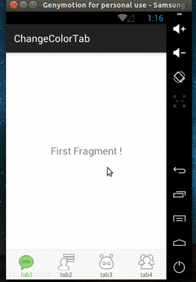

# ChangeColorTab

- **ChangeColorTab** is a simple **TabLayout** extends **LinearLayout** , Host For **ChangeColorItem**.
- **ChangeColorItem** is a custom **View** which can change color when you scroll **ViewPager**.

## Sample


## Usage

#### Import in Gradle

```
compile 'com.xdu.xhin:library:0.1.0'
```

#### layout

```
 <android.support.v4.view.ViewPager
        android:id="@+id/id_viewpager"
        android:layout_width="match_parent"
        android:layout_height="0dp"
        android:layout_weight="1" />

    <com.xdu.xhin.library.view.ChangeColorTab
        android:id="@+id/change_color_tab"
        android:layout_width="match_parent"
        android:layout_height="60dp">

        <com.xdu.xhin.library.view.ChangeColorItem
            android:layout_width="0dp"
            android:layout_height="fill_parent"
            android:layout_weight="1"
            android:padding="5dp"
            tab:item_color="#ff45c01a"
            tab:item_icon="@drawable/ic_menu_start_conversation"
            tab:item_text="tab1"
            tab:item_text_size="12sp" />

        <com.xdu.xhin.library.view.ChangeColorItem
            android:id="@+id/id_indicator_two"
            android:layout_width="0dp"
            android:layout_height="fill_parent"
            android:layout_weight="1"
            android:padding="5dp"
            tab:item_color="@color/colorAccent"
            tab:item_icon="@drawable/ic_menu_friendslist"
            tab:item_text="tab2"
            tab:item_text_size="12sp" />

        <com.xdu.xhin.library.view.ChangeColorItem
            android:layout_width="0dp"
            android:layout_height="fill_parent"
            android:layout_weight="1"
            android:padding="5dp"
            tab:item_color="@color/colorPrimary"
            tab:item_icon="@drawable/ic_menu_emoticons"
            tab:item_text="tab3"
            tab:item_text_size="12sp" />

        <com.xdu.xhin.library.view.ChangeColorItem
            android:layout_width="0dp"
            android:layout_height="fill_parent"
            android:layout_weight="1"
            android:padding="5dp"
            tab:item_color="#ff45c01a"
            tab:item_icon="@drawable/ic_menu_allfriends"
            tab:item_text="tab4"
            tab:item_text_size="12sp" />
    </com.xdu.xhin.library.view.ChangeColorTab>
```

#### Bind to ViewPager
   
```
mViewPager = (ViewPager) findViewById(R.id.id_viewpager);
changeColorTab = (ChangeColorTab) findViewById(R.id.change_color_tab);
changeColorTab.setViewpager(mViewPager);
```

## Thanks

**[HongYang](http://blog.csdn.net/lmj623565791/article/details/41087219)**

## Contact
- **Email**：**<xhinliang@gmail.com>**


